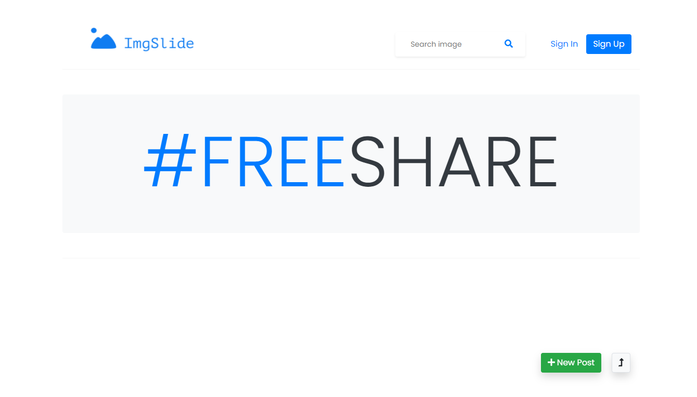
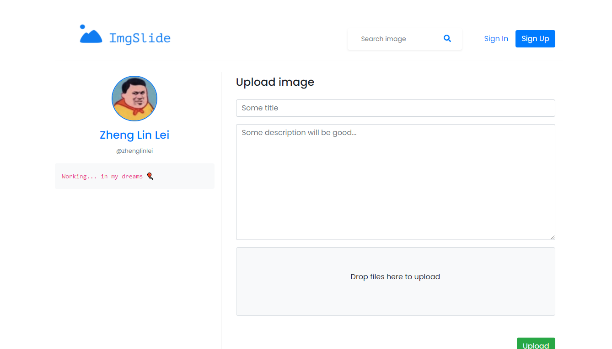

# Imgslide [](https://opensource.org/licenses/Apache-2.0) 

This is a repository about an image share social media, where you can share your images or gif and the people can give likes.



More images [here](#moreimages)

## What I need

You must have these technologies for running this project
```
node
npm
mongodb
```

This project was made with these dependencies from npm
```json
"dependencies": {
    "errorhandler": "^1.5.1",
    "express": "^4.17.1",
    "express-handlebars": "^5.3.2",
    "fs-extra": "^10.0.0",
    "md5": "^2.3.0",
    "mongoose": "^5.12.13",
    "morgan": "^1.10.0",
    "multer": "^1.4.2"
  }
```

## How to run it

Firstly clone the repository and follow all the steps below to run this project.

### 1. Install all dependencies

Execute this command in the path of the project
```
npm install
```

### 2. Install the db (Optional)

This step is optional, because this step only just run all the default data in  `./db.js`, you can use the project without running but you can't see anything in home page because the db is empty
```
npm run import-db
```

### 3. Run server

You can run the project with nodemon
```
npm run start-n
```

Or you can run it without nodemon
```
npm run start
```

### 3. Access to localhost:3000

Node will run this project in port 3000, you can change it in `./src/server/config.js`


## <a name="moreimages"></a> More images





### Love this repo? Give us a star ⭐

<a href="./">
  
</a>